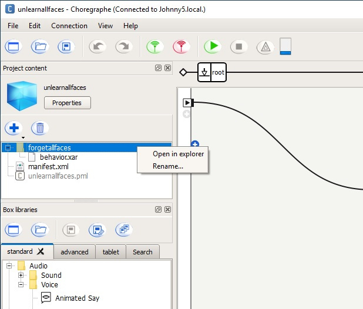
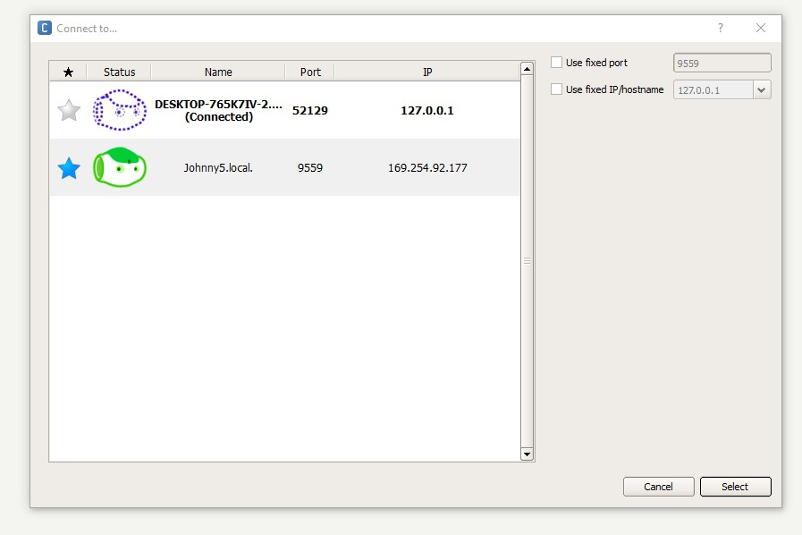

# Nao Robot Programming Guide

#### How to Turn Nao On:
<ol>
<li> Hold down the button on his chest for about 10 seconds. If he begins lighting up, and starts talking, he is on. If he doesn't, he may be dead. Try plugging his charger in, and try step one again.</li>
        *You should charge him for at least 90 minutes before using him. 
       <li> After he's turned on, he will tell you his IP address. If he doesn't, press the chest button again and he will.</li>
<li> Connect Nao to your computer's network and type the IP address he tells you into your browser's address bar. Do this with ethernet, and from there you can connect him to wifi if you want. You will need to login with username and password. </li>
       
       -username: nao
       -password: beget579\[delete

</ol>

___
    
#### How to Connect Nao to Wifi:
<ol>
       <li>After you login with his IP address, select one of the available WiFi networks.</li>
       <li>Complete the required parameters, and click the connect button.</li>
 </ol>
 
___
    
If your computer doesn't automatically connect to Nao's network when you plug in the cable, you will nee to give your ethernet port an IP address with the same subnet as Nao's. Make the first 3 numbers the same as Nao's, and the last number different.

On windows:
<ol>
<li> control panel</li>
<li> network and sharing center</li>
<li> change adapter settings</li>
<li> pick an interface</li>
<li> properties</li>
<li> internet protocol v4</li>
<li> properties</li>
<li> enter ip address and netmask</li>
</ol>

On Linux:
<ol>
<li> open terminal</li>
<li> find out your interface name:</li>

    ifconfig

<li> give that interface an ip address:</li>
       
    sudo ifconfig <interface name> <ip address> netmask 255.255.255.0
    
</ol>

___

#### How to Download Choregraphe:
<ol>
<li> In order to download Choregraphe, Nao has to be registered.</li>
<li> Go to http://doc.aldebaran.com/2-4/dev/community_software.html#retrieving-software</li>
<li> Follow the directions to download the program.</li>
<li> When you're able to open it, it will ask for an activation code.</li>
    -copy and paste the activation code: 654e-4564-153c-6518-2f44-7562-206e-4c60-5f47-5f45

<li> After you type in the activation code, you will be on the home page of the Choregraphe application. </li>
</ol>

___

#### How to do a Basic Choregraphe project:
<ol>
<li> Open your choregraphe application</li>
<li> Click "New Project"</li>
<li> There should be a virtual robot in the bottom right corner. If not:</li>

   -click connection in the top left corner
        
   -click connect to
        
   -click the desktop robot
        
   -if that doesn't work, try exiting out of choregraphe and try again
        
<li> On the left side of the screen, there should be a box with libraries of actions. If not:</li>

   -click view in the top left corner
        
   -click the first option: "box libraries"
        
<li> Click and drag the say option to the middle of the screen</li>
<li> Double click the "say" box, it will bring you to a localized text box</li>
<li> Here, you can change the language, and pick what you want him to say</li>
<li> Type "Hello humans!" into the localized text box</li>
<li> Click root to go back to the main project</li>
<li> Click the small box in the left hand corner with the black arrow</li>
<li> Drag the "noodle" from the first small box to the small box with the black arrow on the "say" box</li>
<li> To run your program, click the green arrow at the top</li>

   -If nothing happens, don't worry. The virtual robot will not talk through your speakers. To make sure it's working, open the dialog box
<li> To open the dialog box, click view, then click the dialog box option</li>

<li> Try running your program again, "Hello humans!" will pop up in the dialog box*</li>

   -when you connect the real robot to your computer, he will say it out loud
    
<li> Don't forget to save your project. Click file, then save project as...</li>
</ol>

 

___

#### Useful links

[Robo-phil youtube channel](https://www.youtube.com/user/robotphilip)

[How to package an application](http://bx.psu.edu/~thanh/naoqi/software/choregraphe/objects/application.html)

___

#### How to Create an Interactive Activity from your Basic Choregraphe project:

Activities are behaviors that your robot can perform when autonomous life mode is on and programmer defined trigger conditions have been met. Activities add interactivity to your robot and let it perform its behaviors in response to an event and without being connected to a computer running Choregraphe.

<ol>
<li> With a project open, locate the “Project content” box on the left sidebar of the screen</li>
<li> Right click on the parent folder of the “behavior.xar” file and select “Rename...”</li>
<li> Choose a descriptive name for your behavior and enter it into the dialog box</li>
       
 

 
    

<li> Next click on the “Properties” button in the “Project content” box to display a window with options for your basic project and its single behavior</li>
<li> Enter a descriptive name in the “Application title” field</li>

 

 
 

<li> In the “Select your package content” box, click on the behavior that you named in step 3</li>
   
 
    

  
 
 
  
<li> Here you can enter a name and description for your behavior</li>
<li> Click on the “Nature” drop-down box and select “Interactive”</li>
<li> In the “Trigger sentences” field, you can enter a sentence and click “Add” to add a phrase that you would like to speak to your robot to trigger this behavior provided the other launch trigger conditions are met</li>
<li> In this example, we use the trigger sentence “It’s time to forget, Johnny.” to trigger the robot to unlearn all faces it has previously learned</li>
<li> In the “Launch trigger condition” field, you can enter different conditions that must be met for your interactive activity to begin once your robot hears the trigger sentence entered in step 10</li>

   -Note: The following link provides documentation that lists all launch trigger conditions and defines the Conditions Expression Language
       http://doc.aldebaran.com/2-1/naoqi/core/triggerconditions.html#launchtriggerconditions

<li> For this example, we will use a simple launch trigger condition that will prevent this behavior from being launched multiple times below</li>

       (‘Launchpad/PreviousActivity’ !=”<application_id>/<behavior_name>”)

<li> Replace <application_id> and <behavior_name> with the application ID you copied in step 6 and the behavior name chosen in step 3</li>

       (‘Launchpad/PreviousActivity’ !=”unlearnallfaces-85cde8/forgetallfaces”)

<li> Copy and paste the information you entered in above steps and save in an external file</li>

   -Note: We are creating a single interactive activity from a basic Choregraphe project at this step. If you decide to combine multiple basic projects into a single application, you will lose the individual project properties defined here when you import your project. Saving these properties in an external file will save time when you go to reconfigure the project properties in your monolithic application.

<li> Click “OK” in the bottom right corner of this window to save the changes you have made to the “Project properties”
<li> Upload the project onto your robot</li>

   -Note: Instructions on how to do this are available in a later section of this guide.

<li> Check the heart symbol in the top right corner of Choregraphe to see if “Autonomous Life’ mode is on for your robot</li>

 

 
 

<li> Click on this button to turn autonomous life mode on if it is not already on</li>
<li> When your robot is listening, say the trigger sentence from step 10</li>

   -Note: You can usually tell if the robot is “listening” by looking into its eyes. The color will be a darker blue than when it is at rest with autonomous life mode off, and there will be an animation where this darker blue is revolving around the center of the eye.

<li> Watch as your robot performs the activity you created</li>

   -Note: We used a simple launch trigger condition that prevents the activity from being performed by your robot multiple times successively. If you are using additional or more complex trigger conditions, make sure these are met before saying the trigger sentence.

</ol>

___

#### How to Make a Project (with multiple parts):

You can combine multiple single behavior projects into one application with multiple behaviors and upload it all at once to your robot. Having a single application like this can make it easier to manage and maintain each behavior by avoiding opening and closing a different project each time you want to want to access the behavior in it.

<ol>
<li> Open your Choregraphe application</li>
<li> Click on “File” then “New project...”</li>
<li> In the “Project content” box left click on the default behavior “behavior_1”</li>
<li> Click on the trash can button to remove this behavior from the project</li>
<li> Then click on the blue plus icon and select “Import folder...” from the drop-down menu</li>
  
 
     

   
 
 
    
<li> Choose a parent folder containing a behavior from your file system and click “Select Folder” to import the behavior</li>
       
   -Note: We are assuming here that you developed each behavior within its own project
       
<li> Repeat steps 5 and 6 for each behavior you wish to add to this project and then check the file tree in the "Project content" box to ensure you have imported all of your behaviors</li>

 

 
 

<li> Click on the “Properties” button in the in the “Project content” window and update the “Application title” field with the name of your new project</li>
<li> Click the “OK” button in the bottom right corner of the window when you are finished editing your project’s name</li>
<li> Click on “File” then “Save project as...” to save your project to the desired location on your computer</li>
       
   -Note: This will update your application ID to include the new project name. YOu also do not want to lose the time you spent importing behaviors if Choregraphe were to quit unexpectedly.
       
<li> For each behavior uploaded. Configure the name, description, trigger sentence(s), and launch trigger conditions as desired</li>

   -Note: If you saved this information to an external file when developing each single behavior project, as recommended previously in this guide, you can simply copy and paste this information for each behavior. If you used your application ID as part of an expression within a launch trigger condition, you will need to update the application ID with the new ID for this new project. You are able to change the project’s application ID if you wish to do so.

<li> Click the “OK” button in the bottom right corner of the window when you are finished editing all of your project’s properties</li>
<li> Click on “File” then “Save” to save your changes</li>
<li> Connect to your physical robot</li>
<li> Upload your multiple activity application to your robot by following the steps in the next section of this guide</li>
</ol>

___

#### How to Upload Projects onto Robot:

<ol>
<li> Open your Choregraphe application and connect to your physical robot (not the virtual robot)</li>
<li> Open the project that you wish to upload to your robot</li>
<li> In the “Robot Applications” box on the right side of your screen click on the “Package and install current project to the robot” button</li>
      
 
 

   
 
 
    
<li> A pop up will appear that informs you that all of behavior files in the project are being transferred to the robot</li>
<li> After this box disappears, your application will be saved on your robot</li>

   -Note: Multiple applications with the same name can be saved to your robot, but they will have unique application ID’s. For instance, you might open a project file from one location on your computer and save this application to your robot. Later, you might move the project in question to a different location, reopen the project to edit, and then upload this improved project to your robot. You may now notice two different applications with the same name but different ID’s, creating confusion. We recommend removing older versions of your application from your project before installing the new version. 

<li> Confirm this by scrolling through the “Robot Application” box and locating your project</li>

   -Note: Applications installed on the robot appear in alphabetical order by application name, not behavior name.

<li> Your robot can now perform all behaviors in your application when autonomous life mode is on and without being connected to a computer running Choregraphe</li>
</ol>

#### Removing an Application from the Robot

<ol>
<li> Right click on the name of the application you want to remove and select “Remove from the robot...”</li>
   
 
    

  
 
 
     
<li> Alternatively, click on the trash can button in the navigation bar of the “Robot Applications” box to remove the currently selected application</li>

   -Note: The currently selected application in the “Robot Applications” box will be marked with a light gray or dark blue background.

<li> The application you selected has now been removed from your robot, which you can confirm by scrolling through the “Robot Applications” windows</li>
</ol>

#### Default States of Behaviors

All behaviors set as default will be run automatically when your robot is turned on. Behaviors currently set as default will have the blue checkered flag icon listed to their right.

<ol>
<li> Right click on any behavior listed below an application in the “Robot Application” box</li>
   
 
    

     
 
 
  
<li> Alternatively, click on the checkered flag button in the navigation bar of the “Robot Applications” box to toggle the default state of the currently selected behavior</li>
<li> Click “Toggle default state” to change the default state of any behavior on your robot</li>
</ol>

#### Testing Applications Already Installed on your Robot

<ol>
<li> A green “play” icon is listed to the right of each behavior in each application uploaded to your robot</li>
<li> Click this button to have your robot perform the behavior saved on it</li>

   -Note: This is useful to learn what behaviors are already installed on your robot when you receive it. You may notice that the trigger sentences and launch trigger conditions for applications you install on your robot may launch unexpected behaviors from applications not installed by you. If you are familiar with the other behaviors on your robot, you can remove these applications to prevent your robot from performing these unexpected behaviors.

</ol>

___

#### Run our Application

You will receive this robot with our application and its 6 behaviors already installed. If you would like to go through the process of installing our application and demonstrating each behavior, follow the instructions below.

<ol>
<li>Go to the following GitHub repository, click “Clone or download”, and then click “Download ZIP”</li>
       https://github.com/dvhar/robot
<li> Click “Save file” then click “OK”</li>
<li> Extract the contents of “robot-master.zip” into the desired directory</li>
<li> Open your Choregraphe application and connect to your physical robot</li>
       
 

       
 
 

<li> Click “File” then “Open project...” and select the “cs4500_sp19.pml” from the location where you extracted the repository</li>
<li> Remove the version of our application "cs4500_sp19 (6)" that is already installed</li>
<li> Upload the project to your robot</li>
<li> Confirm that the application “cs4500_sp19 (6)” is in your “Robot Applications” window</li>
<li> Click the plus icon to the left of the application title to reveal the 6 interactive activities under the application</li>

 

 
 

</ol>

#### Demonstrating Each Behavior

<ol>
<li> Disconnect your robot from your computer by clicking the red “Disconnect” antenna icon located next to the green ”Connect” antenna icon</li>

   -Note: If you connected your robot to your computer with an ethernet cable you can disconnect this as well

<li> Turn on autonomous life mode (if it is not already on) by toggling the heart button in the top right of the screen</li>
<li> Run the following behaviors by activating their trigger conditions</li>

##### fdance

Trigger condition: Say “Can you dance for the class Johnny?” while at least one person is in front of the robot

Expected behavior: Your robot will do “The Floss”

##### forgetallfaces

Trigger condition: Say “It’s time to forget, Johnny”

Expected behavior: Your robot will say “Unlearning complete” if it successfully unlearns all faces it has remembered. If it is unsuccessful, it will say “I can not forget all of your beautiful faces.”

##### highfive

Trigger condition: Say “high five” while at least one person is in front of the robot and the previous activity performed by the robot was not “highfive”

Expected behavior: Your robot will say “can I have a high five?” and wait for your response. You can respond after the click and once your robots blue eyes begin to swirl. If you say “yes” your robot will say “wow, thanks” and raise its right arm for a high five. If you respond “no” you robot will wipe its forehead in shame. After either, your robot will say that it was nice meeting you. Note that your robot will not repeatedly give high fives.

##### nameandface

Trigger condition: Say “let’s get to know each other” or “want to be friends?” while the robot is looking at you and you are staring back into the robot’s eyes

Expected behavior: The robot will respond “please stare into my robot eyes” and try to recognize your face. If it recognizes you, it will say “hello again, (your name), let me show you my dances” and perform the “fdance” behavior followed by the “robotdance” behavior. If it does not recognize you, it will let you know and ask you for your name. You can respond with any name from the following list:

'colby', ’cole', 'gabi', 'eric', 'rachel', 'tyler', 'david', 'allen', 'andrew', 'jet', 'philip',
'matthew', 'naresh', 'mitch', 'keith', 'william', 'levent', 'jonathan', 'steven', 'michael', 'tim', 'tyler'

If it is not confident that your response is one of these names, it will ask you to repeat your name. This behavior will loop until you provide it with one of the names from the above list. When it understand your name it will say “hello (your name), let me learn your face” and attempt to learn your face and associate it with your name. If this is successful, it will reply “success, I will remember you forever” and perform the “highfive” behavior. If learning your face is unsuccessful, it will let you know that it did not learn your face.

##### recognize

Trigger condition: Say “do you remember me?” while the robot is looking at you and you are looking back into the robot’s eyes, and the previous activity performed by the robot was not “recognize”

Expected behavior: The robot will attempt to recognize your face. This will take about 8 seconds if it does not recognize you, at which point the robot will say that it does not recognize you. If it does recognize you, it will recognize you almost instantly and say the name it has associated with your face. It will then ask if you want to see a dance. If you say yes, it will say “wow, thanks” and perform the “robotdance” behavior. If you say no, it will wipe its forehead in shame. After either, it will tell you that it was nice seeing you.

##### robotdance

Trigger condition: Say “can you do the robot?” or “do the robot”

Expected behavior: Your robot will do “The Robot” and transition into “The Sprinkler”

<li> Turn off your robot by holding the button in the center of its chest until it says “gnuk gnuk” meaning “Goodbye” in its robot language</li>
</ol>
